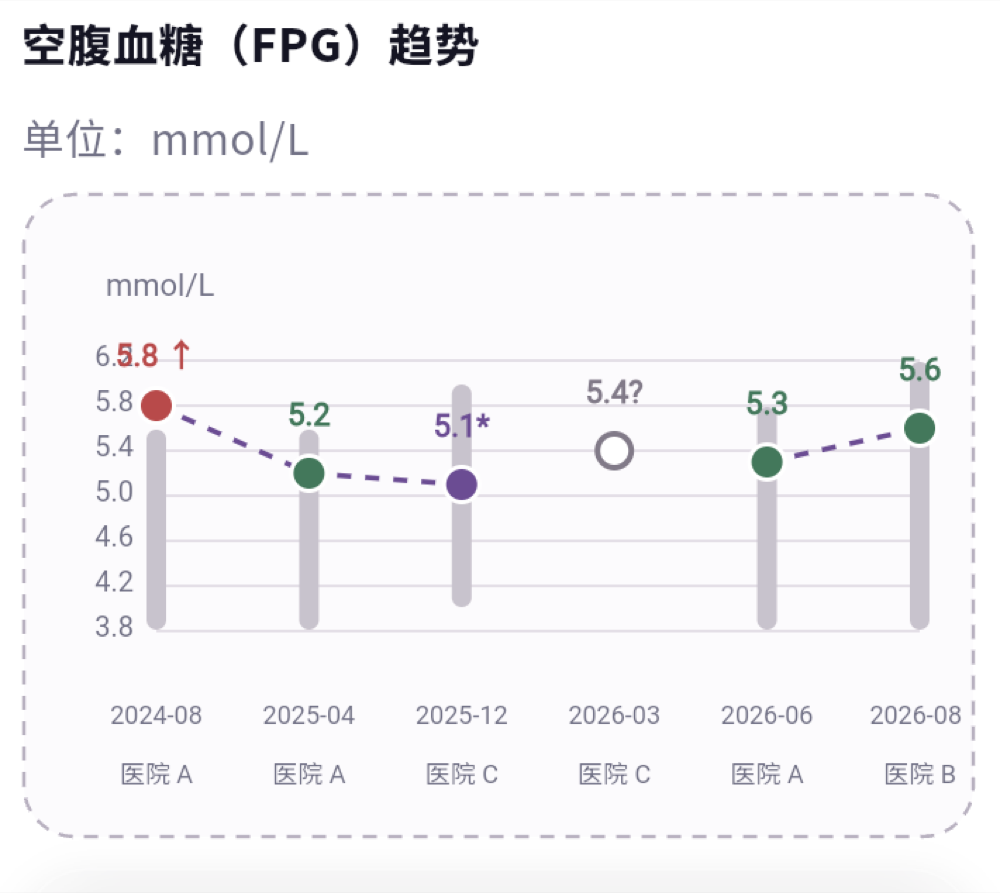

# PMOS ENclaire App

PMOS ENclaire mobile application built with Flutter for iOS and Android, with a
FastAPI and SQLite backend in the same repository. See
[`docs/architecture.md`](docs/architecture.md) for directory boundaries and
security rules, and [`docs/ui-guidelines.md`](docs/ui-guidelines.md) for Flutter
visual and layout rules.

## POMI

**把散落的检查单，变成医生敢直接看的一页报告**

首款 AI + 区块链的女性多囊患者健康管理工具：把散落各家医院的检查单、医嘱、病历，自动整理成一份符合循证医学规范、医生愿意直接采信的复诊存证报告。不诊断、不荐药、不替代医生。

<p align="center">
  
</p>

<p align="center">
  
  
</p>

核心体验包括：拍照或上传医疗资料、OCR 后确认入库、指标趋势追踪、用药记录，以及可分享的医生版就诊报告。

## Repository layout

- `lib/`: Flutter application code
- `test/`: Flutter unit and widget tests
- `android/` and `ios/`: native host projects
- `backend/`: FastAPI API, SQLite migrations, and the OCR worker
- `contracts/`: OpenAPI and JSON Schema contracts shared across components
- `deploy/`: Nginx and systemd deployment assets
- `docs/`: architecture, API, UI, privacy, and technical decisions
- `.github/workflows/`: required CI and security checks

## Requirements

- Flutter 3.47.1 (stable)
- Dart 3.13.1
- VS Code with the recommended Flutter and Dart extensions
- Xcode for iOS development
- Android SDK for Android development

## Get started

```bash
flutter pub get
flutter run
```

## 开发者 Web Preview 启动指南

以下命令均在仓库根目录执行。Preview 默认地址为
`http://127.0.0.1:3001`。

### 1. 首次安装

```bash
flutter doctor
flutter pub get
```

### 2. 使用 Smoke 数据预览（UI 开发推荐）

该模式使用 Flutter App 内置的内存 API，不会启动、代理或依赖任何后端服务。
登录、注册、Onboarding 和首页均可离线查看。

终端 1——构建 Preview：

```bash
flutter build web --dart-define=POMI_SMOKE_MODE=true
```

终端 2——启动静态服务：

```bash
python3 tools/web_preview_proxy.py \
  --root build/web \
  --port 3001
```

打开 <http://127.0.0.1:3001>。修改 Flutter 代码后，在终端按 `Ctrl+C`
停止服务，重新构建并启动。刷新浏览器页面会重置 Smoke 数据。

如需在普通浏览器中使用 Flutter 热重载，可改用：

```bash
flutter run -d chrome \
  --web-hostname 127.0.0.1 \
  --web-port 3001 \
  --dart-define=POMI_SMOKE_MODE=true
```

### 3. 连接后端进行预览

浏览器联调使用同源 Preview 代理：API 请求先发送到本地 Preview，再由代理转发至
目标后端，从而避免浏览器 CORS 限制。构建时不添加 `POMI_SMOKE_MODE=true`，否则
App 会使用前端内存数据，不会发出任何后端请求。

终端 1——将 Preview 地址设为 App 的 API Base URL 并构建：

```bash
flutter build web \
  --dart-define=POMI_API_BASE_URL=http://127.0.0.1:3001
```

终端 2——启动页面，并将 `/api/*` 转发至已部署后端：

```bash
python3 tools/web_preview_proxy.py \
  --root build/web \
  --backend server \
  --upstream https://api.healy1012-ops.top \
  --port 3001
```

测试其他服务器时替换 `--upstream` 地址；该参数必须是完整的 HTTPS URL。
此模式不要添加 `POMI_SMOKE_MODE=true`，因为 Smoke 模式不会发出网络请求。

检查当前 Preview 选择的后端：

```bash
curl http://127.0.0.1:3001/__preview/backend
```

#### 本地前后端联调（当前开发分支）

先启动本地 FastAPI（默认使用 `backend/runtime/pomi.db`）：

```bash
cd backend
alembic upgrade head
uvicorn pomi_backend.main:app --host 127.0.0.1 --port 8000
```

再在仓库根目录构建并启动 Preview 代理：

```bash
flutter build web \
  --dart-define=POMI_API_BASE_URL=http://127.0.0.1:3001
python3 tools/web_preview_proxy.py \
  --root build/web \
  --backend local \
  --local-upstream http://127.0.0.1:8000 \
  --port 3001
```

打开 <http://127.0.0.1:3001/>，登录本地账号后，页面请求会经 3001 转发到 8000。
可用 `curl http://127.0.0.1:3001/__preview/backend` 检查当前代理模式。

仅在开发者明确需要本地后端时，可使用：

```bash
python3 tools/web_preview_proxy.py \
  --root build/web \
  --backend local \
  --local-upstream http://127.0.0.1:8000 \
  --port 3001
```

本地后端是可选项；正常前端开发应使用 Smoke 数据或已部署后端。

#### 本地数据与 GitHub

`backend/runtime/` 仅用于本机 SQLite、上传文件和 OCR 运行时数据，已加入
`.gitignore`，不会随 PR 提交。开发者账号及其医疗演示数据只保存在本地数据库，
不会上传 GitHub；PR 仅包含代码、迁移、测试和可公开的 Smoke fixture。

### 4. 常见问题

如果 `3001` 端口已被占用，先查看占用进程：

```bash
lsof -nP -iTCP:3001 -sTCP:LISTEN
```

在原终端按 `Ctrl+C` 停止已有 Preview；也可以同时修改构建地址和代理端口，例如：

```bash
flutter build web \
  --dart-define=POMI_API_BASE_URL=http://127.0.0.1:3010
python3 tools/web_preview_proxy.py --root build/web --port 3010
```

如果浏览器仍显示旧版本，请强制刷新，或清除 `127.0.0.1` 的站点数据。Preview
联调禁止使用真实生产账号和敏感数据，应使用专用测试账号与测试数据。

## Quality checks

Run the same core checks used by GitHub Actions:

```bash
dart format --output=none --set-exit-if-changed lib test
flutter analyze --fatal-infos
flutter test
```
